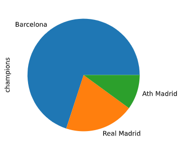
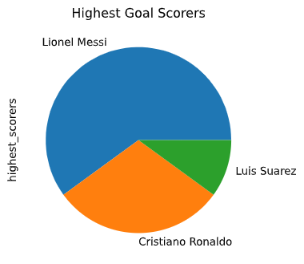

## Hi!I am Ayodabo Tomisin and welcome to my analysis of the Spanish La Liga seasons fron the year 2010 to year 2019

The Spanish La Liga is the football competition held in Spain among the top twenty clubs of the country who vye for the top team in the country by winning the trophy.

From 2009/10 to 2015/16, La Liga was known as **La Liga BBVA**, as parts of a sponsorship deal with _BBVA_, a financial service providers headquartered in Spain. From there onwards, **Santander**, a Spanish group of companies focused also, on financial services.

## A QUICK TOUR AROUND THE ANALYSIS I GENERATED

For my analysis, I looked at many areas and key parts like;

*top team for the past ten years
* top goalscorers
* total home wins over the years
* total goal scored over the years
* total home wins by team
* number of teams that have played in the La Liga over the course of ten years

and others for which I wil give a plot to depict them

### Let's start

For the top team over the years from the data collected, Barcelona have dominated the La Liga, winning 7 titles with three coming in a row during 2009-2011 years

Format: ![Champions for the past ten years]

For top goal scorers, it is not a suprise that Lionel Messi tops the chart

Home teams have better winning percentage with a whooping _48.1%_ of the 3800 games played accross the years. This can be used to deduce that for the next seasons to follow, home teams have a higher chance of winning, this can be seen as a result of reasons including
    * home fans' support
    * familiarity with home pitch
    *home advantage(as fans says 😅)

    Let me show a graph depicting the distribution of home and away wins
    

You can read further analysis [here]("ANALYSIS OF THE SPANISH FOOTBALL LEAGUE FROM 2009 TO 2019.docx")

This dataset contains data for last 10 seasons of Spanish La Liga including current season. The data is updated on weekly basis via Travis-CI. The dataset is sourced from http://www.football-data.co.uk/ website and contains various statistical data such as final and half time result, corners, yellow and red cards etc.